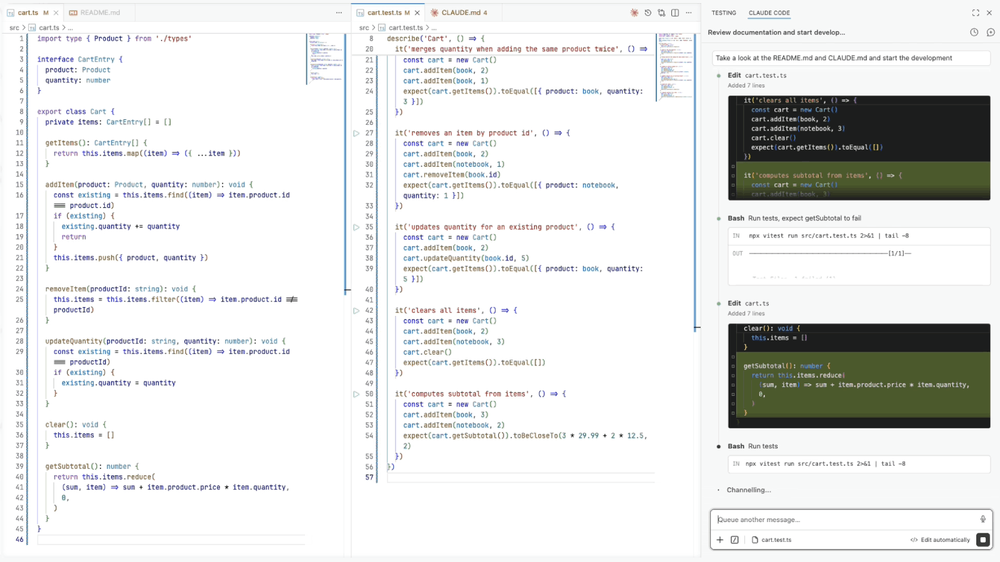

# Conduct

[](https://www.npmjs.com/package/@nizos/conduct)
[](https://www.npmjs.com/package/@nizos/conduct)
[](https://github.com/nizos/conduct/actions/workflows/ci.yml)
[](https://github.com/nizos/conduct/actions/workflows/security.yml)
[](LICENSE)

Process discipline for AI coding agents.

## Overview

Conduct is a policy engine that sits between coding agents and your codebase, evaluating each attempted action against configurable rules. It generalizes [tdd-guard](https://github.com/nizos/tdd-guard) beyond TDD and across coding agents.

<p align="center">
  <a href="https://nizar.se/uploads/videos/conduct-demo.mp4">
    
  </a>
  <br>
  <em>Click to watch Conduct enforce TDD</em>
</p>

## Features

- **Multi-Agent Support** - Works with Claude Code, OpenAI Codex, and GitHub Copilot
- **TDD Enforcement** - Blocks code without a failing test, works with any test runner
- **Pattern Rules** - Block command or content patterns by string or regex
- **Deterministic and AI Rules** - Deterministic checks when possible, model validation when needed
- **Custom Rules** - Define your own rules alongside the built-in ones

## Getting started

Install Conduct as a dev dependency, then [wire it into your agent](docs/setup.md):

```
npm install -D @nizos/conduct
```

Create a `conduct.config.ts` config file at the root of your project.

### Example Configuration

A few rules in action. See the [rules reference](docs/rules.md) for the full list.

```ts
import { defineConfig, enforceTdd, forbidContentPattern } from '@nizos/conduct'

export default defineConfig({
  rules: [
    {
      files: ['src/**', 'test/**'],
      rules: [
        enforceTdd(),
        forbidContentPattern({
          match: 'eslint-disable',
          reason: 'Fix the lint violation rather than disabling the rule',
        }),
      ],
    },
  ],
})
```

## Contributing

Contributions are welcome! See the [contributing guidelines](CONTRIBUTING.md) to get started.

## License

[MIT](LICENSE)
