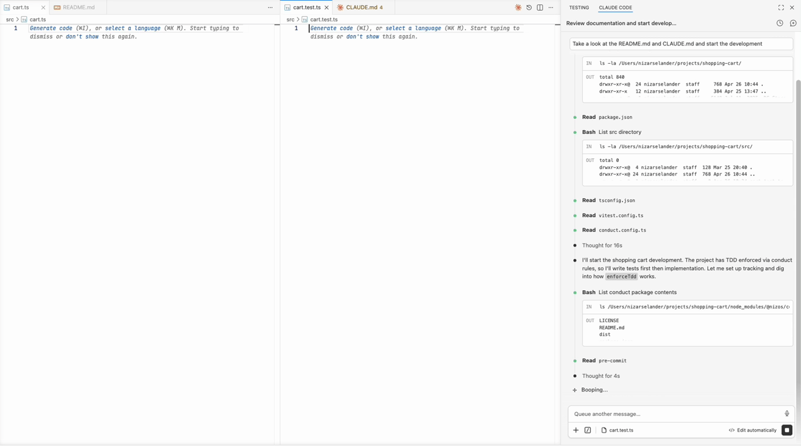

# Probity

[](https://www.npmjs.com/package/@nizos/probity)
[](https://www.npmjs.com/package/@nizos/probity)
[](https://github.com/nizos/probity/actions/workflows/ci.yml)
[](https://github.com/nizos/probity/actions/workflows/security.yml)
[](LICENSE)

Process discipline for AI coding agents.

<p align="center">
  
</p>

Probity catches what coding agents do wrong (over-implementing past the failing test, disabling tests instead of fixing them, reaching for `rm -rf`) using the hook system your agent already exposes.

## How it works

Each agent action (file write, shell command) fires a hook. Probity evaluates the action against your configured rules and decides whether it goes through. When it blocks, the agent gets a reason and a path forward:

```
probity: production code is being added before any failing test was written
or observed.

The next TDD-legal step is to add one focused test in src/cart.test.ts and
run it to a clean assertion failure before implementing only the minimum code
to pass it.
```

Probity grew out of [tdd-guard](https://github.com/nizos/tdd-guard), built to be the better foundation for the work ahead: rules beyond TDD, agents beyond Claude Code.

## Features

- Catches over-implementation and missing tests by reading your agent's session history (works with any test runner, in any language)
- Same config across Claude Code, Codex, GitHub Copilot Chat, and Copilot CLI: one rule set, every agent
- Pattern blocks for commands and content (string or regex) for the deterministic checks
- Custom rules in a few lines of TypeScript

## Getting started

Install Probity as a dev dependency, then [wire it into your agent](docs/setup.md):

```
npm install -D @nizos/probity
```

Create a `probity.config.ts` at your project root.

Here's a starter that enforces TDD on `src/` and `test/`, and blocks `eslint-disable` comments:

```ts
import { defineConfig, enforceTdd, forbidContentPattern } from '@nizos/probity'

export default defineConfig({
  rules: [
    {
      files: ['src/**', 'test/**'],
      rules: [
        enforceTdd(),
        forbidContentPattern({
          match: 'eslint-disable',
          reason: 'Fix the lint violation rather than disabling the rule',
        }),
      ],
    },
  ],
})
```

## Documentation

- [Setup](docs/setup.md): wire probity into your agent
- [Configuration](docs/configuration.md): config file shape, path scoping, and custom rules
- [Rules](docs/rules.md): built-in rules and their options

## Contributing

Contributions are welcome! See the [contributing guidelines](CONTRIBUTING.md) to get started.

## License

[MIT](LICENSE)
